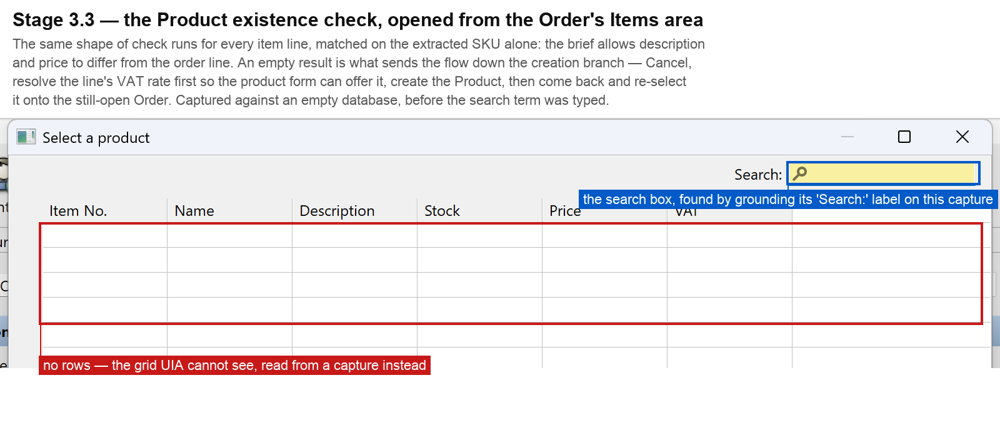

# Annotated screenshots

Five points in the flow, in the order they happen: the two decisions that drive the
creation branches, then the three results the brief asks to have verified.

All of these come from the real application, captured by the same code the flow uses.
`vision.capture_region` grabs the framebuffer rather than asking a control to paint
itself, because SWT draws through Java and `PrintWindow` returns a black rectangle.

## 1. The Debtor existence check — stage 2.3

The brief's exact-match rule, applied to a grid UIA cannot see at all: where the rows
should be, the tree holds a single empty pane. It is read from a capture into dicts keyed
by column, which is the shape `matching.py` already consumes. Note the clipped `Company`
cell, which is why a match is tested on the prefix rather than by equality.

## 2. The Product existence check — stage 3.3

The same shape of check, per item line, matched on the SKU alone. An empty result is what
sends the flow to the creation branch: resolve the VAT rate first, create the Product,
then come back and re-select it onto the still-open Order.

## 3. The saved Order — stage 4

Both products resolved through the Order's own selector, quantities written into the
drawn Items grid through its cell editors, and Total Net, VAT and Total checked against
the source document *before* the single save the brief allows.

## 4. The linked Invoice — stage 5

Created from the Order's own **Create a follow-up document** group rather than the
toolbar, which is what preserves the Order relationship, then checked field by field
against the source document before its payment status was applied.

## 5. The final verification — stage 5.5

The Invoice listed as **paid** for 737.80, with its source Order still listed as **open**
for the same total. This is the check the whole design is built around: the editor shows
what was typed, and Data > Documents shows what Fakturama actually stored.

---

Screenshots 3 to 5 come from one continuous run against a database where the master data
already existed, so the creation branches did not execute in it. Screenshots 1 and 2 are
from runs against an empty database, where they did. The run logs, not these images, are
the evidence for the creation branches end to end.
