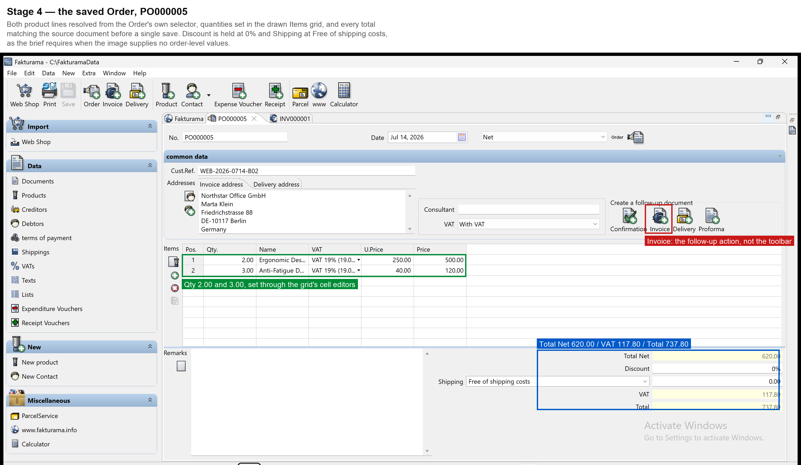
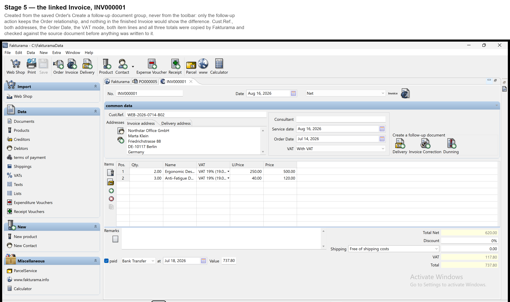
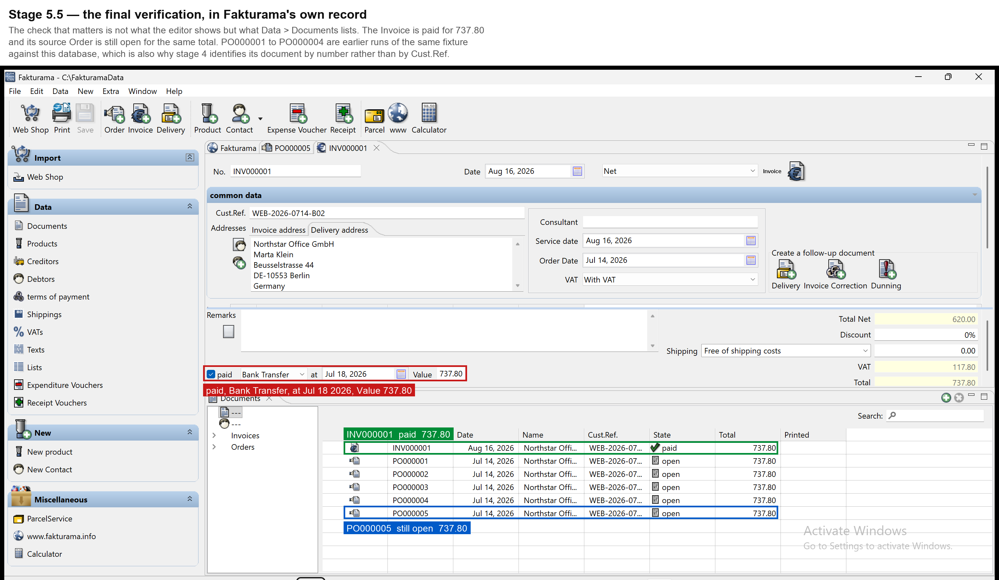

# Annotated screenshots

One complete run, photographed at the three points where the brief asks for the result to
be verified. These come from the real application, captured by the same code the flow
uses (`vision.capture_region`, which grabs the framebuffer, because SWT draws through
Java and `PrintWindow` returns a black rectangle).

The run behind them is:

```
python run.py data\order.png --extraction tests\fixtures\order_without_line_discount.json
```

which is the sample document with line 1's discount removed, because this Fakturama's
item grid has no Discount column and the real document therefore stops for manual review
in stage 3. The README explains that in full.

## 1. The saved Order — stage 4



Both products resolved through the Order's own selector, quantities written into the
drawn Items grid through its cell editors, and Total Net, VAT and Total checked against
the source document *before* the single save the brief allows.

## 2. The linked Invoice — stage 5



Created from the Order's own **Create a follow-up document** group rather than the
toolbar, which is what preserves the Order relationship, then checked field by field
against the source document before its payment status was applied.

## 3. The final verification — stage 5.5



The Invoice listed as **paid** for 737.80, with its source Order still listed as **open**
for the same total. This is the check the whole design is built around: the editor shows
what was typed, and Data > Documents shows what Fakturama actually stored.
