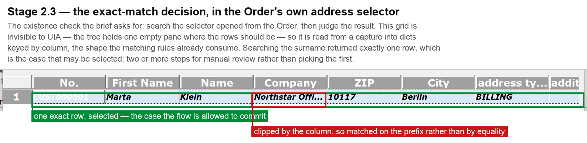

# Annotated screenshots

Four points in the flow: the decision that drives the Debtor branch, then the three
results the brief asks to have verified.

All of these come from the real application, captured by the same code the flow uses.
`vision.capture_region` grabs the framebuffer rather than asking a control to paint
itself, because SWT draws through Java and `PrintWindow` returns a black rectangle.

**Where each one comes from** is stated below rather than left to be assumed, because two
different runs are involved and they prove different things.

## 1. The Debtor existence check — stage 2.3

The brief's exact-match rule, applied to a grid UIA cannot see at all: where the rows
should be, the tree holds a single empty pane. It is read from a capture into dicts keyed
by column, which is the shape `matching.py` already consumes. Note the clipped `Company`
cell, which is why a match is tested on the prefix rather than by equality.

*From a diagnostic probe against the live application, not from a full run.* The search
and the selection are real; the probe stopped before committing, so this shows the
decision rather than its outcome.

## 2. The saved Order — stage 4

Both products resolved through the Order's own selector, quantities written into the
drawn Items grid through its cell editors, and Total Net, VAT and Total checked against
the source document *before* the single save the brief allows.

## 3. The linked Invoice — stage 5

Created from the Order's own **Create a follow-up document** group rather than the
toolbar, which is what preserves the Order relationship, then checked field by field
against the source document before its payment status was applied.

## 4. The final verification — stage 5.5

The Invoice listed as **paid** for 737.80, with its source Order still listed as **open**
for the same total. This is the check the whole design is built around: the editor shows
what was typed, and Data > Documents shows what Fakturama actually stored.

---

Screenshots 2 to 4 are one continuous run, ending in a saved and verified Invoice. That
run went against a database where the master data already existed, so the creation
branches did not execute in it. The creation branches — payment method, Debtor with a
separate delivery address, VAT rate and both Products — were exercised against an empty
database in a later run, and the run log rather than an image is the evidence for those.
